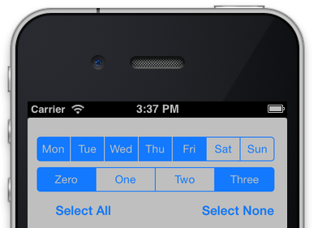

# MultiSelectSegmentedControl

Multiple selection segmented control.

[![Build Status][travis-image]][travis-url]
[![License][license-image]][license-url]
[](https://img.shields.io/cocoapods/v/MultiSelectSegmentedControl.svg)
[](http://cocoapods.org/pods/MultiSelectSegmentedControl)
[](http://makeapullrequest.com)



A subclass of `UISegmentedControl` that supports selecting multiple segments.

No need for images - works with the builtin styles of UISegmentedControl.

## Features

- [x] Standard iOS look and feel.
- [x] Use from either storyboard or code.

## Requirements

- iOS 8.0+
- Xcode 7.3

## Installation

#### CocoaPods
You can use [CocoaPods](http://cocoapods.org/) to install `YourLibrary` by adding it to your `Podfile`:

```ruby
platform :ios, '8.0'
use_frameworks!
pod 'MultiSelectSegmentedControl'
```

To get the full benefits import `YourLibrary` wherever you import UIKit

``` swift
import UIKit
import MultiSelectSegmentedControl
```

## Usage

### Creating a MultiSelectSegmentedControl

In Interface Builder:
1. Drag a `UISegmentedControl` into your storyboard.
2. Set its class to `MultiSelectSegmentedControl`.
3. Set an outlet for it, e.g., `myMultiSeg`.

In code:
``` objc
self.myMultiSeg = [[MultiSelectSegmentedControl alloc] init];
```

### Setting selected segments

``` objc
myMultiSeg.selectedSegmentIndexes = [NSIndexSet indexSetWithIndex:1];
```

### Getting selected segments

``` objc
NSIndexSet *selectedIndices = myMultiSeg.selectedSegmentIndexes;
```

Or to get the titles:

``` objc
NSArray *titles = myMultiSeg.selectedSegmentTitles;
```

### Handling user selection changes

To be notified of changes to the control's value, make sure your ViewController conforms to the delegate protocol:

``` objc
@interface MyViewController : UIViewController <MultiSelectSegmentedControlDelegate>
```

...and set the delegate, perhaps in your `viewDidLoad` method:

``` objc
myMultiSeg.delegate = self;
```
Then override the delegate protocol method:

``` objc
-(void)multiSelect:(MultiSelectSegmentedControl *)multiSelectSegmentedControl didChangeValue:(BOOL)selected atIndex:(NSUInteger)index {
	if (selected) {
		NSLog(@"Selected segment %u", index);
	} else {
		NSLog(@"Deselected segment %u", index);
	}
}
```

## Meta

[@yonatsharon](https://twitter.com/yonatsharon)

[https://github.com/yonat/MultiSelectSegmentedControl](https://github.com/yonat/MultiSelectSegmentedControl)

[swift-image]:https://img.shields.io/badge/swift-3.0-orange.svg
[swift-url]: https://swift.org/
[license-image]: https://img.shields.io/badge/License-MIT-blue.svg
[license-url]: LICENSE.txt
[travis-image]: https://img.shields.io/travis/dbader/node-datadog-metrics/master.svg?style=flat-square
[travis-url]: https://travis-ci.org/dbader/node-datadog-metrics
[codebeat-image]: https://codebeat.co/badges/c19b47ea-2f9d-45df-8458-b2d952fe9dad
[codebeat-url]: https://codebeat.co/projects/github-com-vsouza-awesomeios-com
