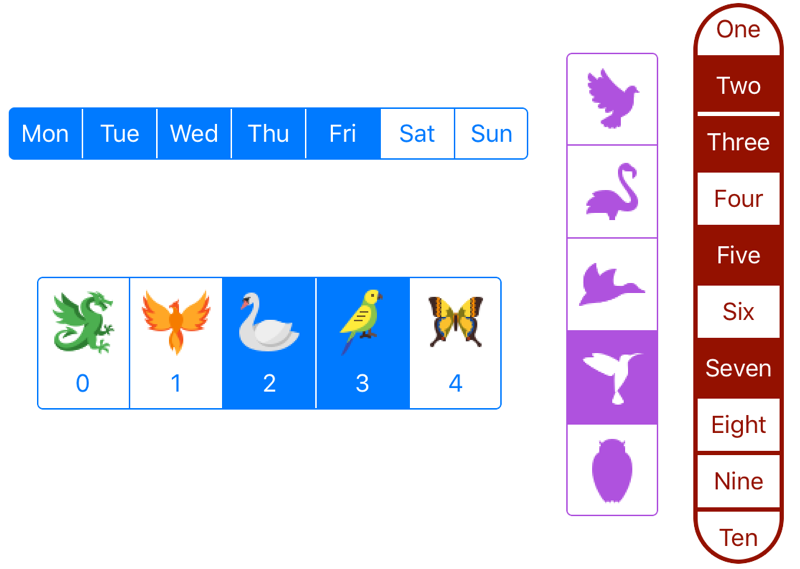

# MultiSelectSegmentedControl

[![Swift Version][swift-image]][swift-url]
[![Build Status][travis-image]][travis-url]
[![License][license-image]][license-url]
[](https://img.shields.io/cocoapods/v/MultiSelectSegmentedControl.svg)  
[](http://cocoapods.org/pods/MultiSelectSegmentedControl)
[](http://makeapullrequest.com)

UISegmentedControl remake that supports selecting multiple segments, vertical stacking, combining text and images.

## Features

- [x] Single or multiple selection.
- [x] Horizontal or vertical stacking.
- [x] Can show text and images together.
- [x] Use from either storyboard or code.
- [x] UIAppearance support.

## Usage

Very similar to `UISegmentedControl`, can be used as a drop-in replacement in most cases.

### Creating Segments

Each segment can contain an image, a text, or both:

```swift
let multiSelect = MultiSelectSegmentedControl()
multiSelect.items = ["One", "Two", image, [image2, "Text"], "Last"]
```

Images are shown in full color (unlike `UISegmentedControl`). To make them render in the same `tintColor` as the control, use template mode:

```swift
multiSelect.items = [image1, image2, image3].map { $0.withRenderingMode(.alwaysTemplate) }
```

### Selecting Segments

```swift
multiSelect.selectedSegmentIndexes = [1, 2, 4]
```

Or just single selection:

```swift
multiSelect.allowsMultipleSelection = false
multiSelect.selectedSegmentIndex = 3
```

### Getting Selected Segments

```swift
let selectedIndices: IndexSet = multiSelect.selectedSegmentIndexes
```

Or to get the titles:

```swift
let titles: [String] = multiSelect.selectedSegmentTitles
```

### Handling User Selection Changes

You can use standard target-action:

```swift
multiSelect.addTarget(self, action: #selector(selectionChanged), for: .valueChanged)
```

Or conform to the delegate protocol:

```swift
extension MyViewController: MultiSelectSegmentedControlDelegate {
    func multiSelect(_ multiSelectSegmentedControl: MultiSelectSegmentedControl, didChange value: Bool, at index: Int) {
        print("selected \(value) at \(index)")
    }
}
```

... and set the delegate:

```swift
multiSelect.delegate = self
```

### Changing Appearance

Color:

```swift
multiSelect.tintColor = .green
```

Shape:

```swift
multiSelect.borderWidth = 3 // Width of the dividers between segments and the border around the view.
multiSelect.borderRadius = 32 // Corner radius of the view.
```

Stack the segments vertically:

```swift
multiSelect.isVertical = true
```

Stack each segment contents vertically when it contains both image and text:

```swift
multiSelect.isVerticalSegmentContents = true
```

## Installation

### CocoaPods:

```ruby
pod 'MultiSelectSegmentedControl'
```

## TODO

- [ ] `titleTextAttributes: [UIControl.State: [NSAttributedString.Key : Any]]`
- [ ] foreground color of selected segment should be/appear transparent
- [ ] configure segment `layoutMargins`, `stackView.spacing`


## Meta

[@yonatsharon](https://twitter.com/yonatsharon)

[https://github.com/yonat/MultiSelectSegmentedControl](https://github.com/yonat/MultiSelectSegmentedControl)

[swift-image]:https://img.shields.io/badge/swift-5.0-orange.svg
[swift-url]: https://swift.org/
[license-image]: https://img.shields.io/badge/License-MIT-blue.svg
[license-url]: LICENSE.txt
[travis-image]: https://img.shields.io/travis/dbader/node-datadog-metrics/master.svg?style=flat-square
[travis-url]: https://travis-ci.org/dbader/node-datadog-metrics
